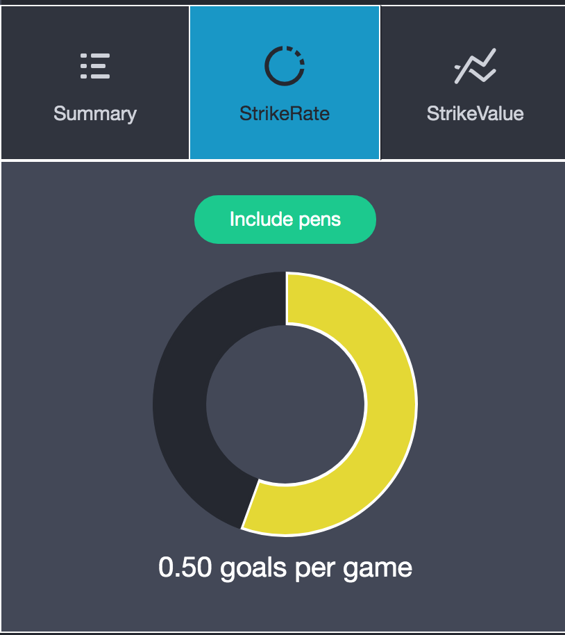

<h1 align='center'>StrikeForce Website</h1>

 

Code Institute Diploma in Software Development: Interactive Frontend Development - Milestone Project

<a href="https://loosenthedark.github.io/strikeforce/" style="font-weight:bold;">Live link to deployed project</a> (hosted on GitHub Pages)

---

**StrikeForce** is an interactive frontend site, offering users a bespoke data portal through which they can browse, select and sort through a range of information and statistics relating to goals scored in the English Premier League this season (2020-21). The site meets the needs and objectives of a variety of users by allowing them to actively engage with the relevant data to gain a clear understanding of the facts behind the figures. Both first-time and returning visitors will be impressed by StrikeForce's minimalist mobile-first design and its intuitive navigation and layout, while their knowledge of PL goalscorers will be enriched by the site's incisive and intelligent data analysis.

## User Experience (UX)

An abundance of football data websites exist nowadays, each claiming to offer visitors a definitive breakdown of the statistics and trends that matter. However, most of these sites actually only give incomplete overviews, due for the most part to poorly-collated data and misleadingly-labelled visualisations. StrikeForce aims to address such shortcomings by presenting users with robust, reliable and "meaningful data for the beautiful game" (the site's tag line, as cited in the `title` element at the top of each page).

As such, the site's user experience can best be illustrated by outlining a variety of **User Stories**, from inception to completion, in order to showcase how StrikeForce empowers a diverse cross-section of visitors to achieve their (often overlapping and interrelated) goals.

In no particular order, a list of such User Stories includes, but is not limited to, the following:

1. _"As a fan of the [Premier League](https://en.wikipedia.org/wiki/Premier_League) in general, I'm looking for a dashboard-style website that's easy to navigate and gives a clear and concise breakdown of who the most free-scoring players and teams are, and how potent they are compared to others."_
2. _"As a fan of the player [Patrick Bamford](https://en.wikipedia.org/wiki/Patrick_Bamford), I want to be able to track his goalscoring record over the course of the season."_
3. _"As a fan of the club [Leeds United](https://en.wikipedia.org/wiki/Leeds_United_F.C.), I want to be able to track its goalscoring record over the course of the season."_
4. _"As a non-English speaking fan of the Premier League and frequent social media user, I wish to be able to search for goalscorers by the hashtags/acronyms associated with their clubs that I see on Instagram, Twitter etc."_
5. _"As a statistically-minded follower of the PL, I take issue with most readily-available 'leading goalscorer' charts, as they tend to include penalties scored. For instance, both the [BBC](https://www.bbc.com/sport/football/premier-league/top-scorers) and [official PL](https://www.premierleague.com/stats/top/players/goals) rundowns present their data in an unfiltered and therefore somewhat misleading manner. For me, the mark of a top striker is someone who scores regularly from open play, so I'd like to be able to access a chart that's adjusted for penalties scored."_
6. _"As an avid [Fantasy Premier League](https://fantasy.premierleague.com/) participant, I already know who the top PL scorers outright are, but I need to find out which players offer the best 'value for money' return, i.e. goals scored per €1 million valuation, as I look to assemble my virtual squad for the rest of the 2020-21 season."_
7. _"As a return visitor to the site, I would like to be able to follow it on social media so I can keep up to date with its content."_
8. _"As someone who favours traditional email over social media, I'm wondering if it's possible to sign up to StrikeForce's mailing list in order to be made aware of any updates and announcements."_
9. _"As site owner, I am looking to build a community of regular users who come to view StrikeForce as their 'one-stop shop' source of accurate and informative PL goalscoring data. In order to do this, I need a site that's user-friendly, feels lightweight and uncluttered and is designed to be fully responsive across all device sizes."_

From a **Design** perspective, the look and feel of [this 'Dashboard' Official Bootstrap Theme](https://themes.getbootstrap.com/product/dashboard/) struck me as a solid foundation on which to base the site, as it offers a slick, modern-looking template design and a suite of eye-catching components and plugins to help drive engagement and deliver a dynamic user experience. The theme is built on top of [Bootstrap's core (v4.0.0-alpha.6)](https://v4-alpha.getbootstrap.com/) and is tailored towards interactive data visualisation and presentation.

Besides white and off-white for several of the site's Heading elements, the two main **colours** used throughout are a deep charcoal/slate grey for the `body`'s main background and a piercing ocean blue for standout site logos and interactive buttons, tabs, directional arrows etc. Both of these were available [right out of the box with the BS theme I had chosen](https://themes.getbootstrap.com/preview/?theme_id=1468) - the latter as its '-primary' color for use with relevant components - and since they also offered [an acceptable colour contrast ratio](https://webaim.org/resources/contrastchecker/?fcolor=1997C6&bcolor=252830), I decided to go with them as my main colour scheme. These were supplemented by secondary use of more muted greyish tones for elements such as tabular data text and `footer` and `nav` icons.

My choice of **font** for the site's main logo was informed by the ready availability of [Entypo](http://entypo.com/), which came bundled with the Dashboard theme and also gave access to "an awesome, high quality set of icon glyphs" [per the theme's docs](https://themes.getbootstrap.com/preview/?theme_id=1468) for use in lieu of Bootstrap's default icon font, Glyphicons. The widely-used Roboto font was used everywhere else throughout the site, with Helvetica Neue > Helvetica > Arial > sans-serif as the stated fallback options.

The site opts for a minimalist approach in terms of **imagery**: there is no background hero image, for instance, on the main landing page. It was felt that this might distract site visitors from focusing on the main search bar when they first arrive, and so background images have been forsaken in favour of informational icons that are used sparingly but effectively to guide the user. A compilation of these icons can be viewed as part of the flashing hero animation on the site's 'About' page. These have mostly been sourced from the aforementioned Entypo library, but a few [Font Awesome](https://fontawesome.com/) icons have also been selected.

Apart from this, dynamically-loaded imagery such as player profile photos and club crests and international flags for scorer summary data has been retrieved and inserted into the DOM by API calls to the (unofficial) [TransferMarket API](https://rapidapi.com/apidojo/api/transfermarket). The crests used elsewhere within the site were all downloaded from the relevant club [Wikipedia](https://en.wikipedia.org/wiki/Main_Page) pages, and as such are used here in line with that site's 'fair use' policy.

## Features

### Main landing page:

- Inspiration for scorer/club search functionailty gained from [this Traversy Media video tutorial](https://www.youtube.com/watch?v=1iysNUrI3lw&list=PLillGF-RfqbbnEGy3ROiLWk7JMCuSyQtX&index=16) on leveraging JSON data to build an autocomplete application

- Users can toggle with ease between scorer and club search bars

- The autocomplete filter returns all available matches from the relevant (local) JSON files for search strings greater than two characters in length in the case of scorers and greater than zero characters in the case of clubs:

- Once a dynamic list of matching scorers/clubs has been returned, users may select an individual scorer/club by clicking on the appropriate `.btn-strike-rate(-club)` `<a>` element on the right-hand side of each player's/club's data panel:

- This will load the data dashboard relating to the scorer/club in question, each of which consists of a header image and main content pane separated by a tabbed navigation bar that can be clicked to select from a total of three custom `.statcard` data visualisation components: one of these (labelled 'Summary') displays static data, while the other two ('StrikeRate' and 'StrikeValue') allow users to interact by filtering the data to be displayed (e.g. by clicking a toggle button that either excludes or includes penalties scored from the data rendered in chart form):

### Leaderboard pages:
  
- Each of the site's three subcategorised Leaderboard pages (again divided by 'Summary', 'StrikeRate' and 'StrikeValue', thus establishing a consistent, intuitive navigational theme) consists of sortable tabular data.
- Not only can users swiftly move between these three different table categories (either by using the site's main `nav` menu or by clicking on one of the three secondary nav tabs directly above each table)...

- ...but they can also alternate between viewing individual and club goalscoring leaderboards by means of a pure CSS custom switch that was built using tips and code blocks from [Martin Haubek](https://haubek.github.io/custom-switch/) and retrieved from [this article](https://www.cssscript.com/ios-style-switches-bootstrap-4/):

- By default, each table is sorted in descending order of goals scored outright, as indicated by the downward-pointing directional arrow visible in the bottom-right corner of the 'Goals' `th` element in the first screenshot below. However, as seen in the second screenshot, users may interact with each table to rearrange the data by clicking on the appropriate `th` category. Data can also be arranged in either descending (downward-pointing arrow) or ascending (upward-pointing arrow) order, according to user preference:

### Dashboard pages:

- As an alternative to using the main landing page's autocomplete search bars to access data visualisations for individual scorers/clubs, users may instead select from a list of valid options when they navigate to one of the two (Scorers / Clubs) dashboard landing pages. Here they will be prompted by a CSS3 animation effect on the `.dropdown-toggle` `button` element to trigger a `.dropdown-menu`:

- In the case of the Scorer dashboards `.dropdown-toggle`, the content of a second (initially hidden) `.dropdown-menu` element will be populated according to the user's choice when prompted to "Choose a club". For instance, if the user selects 'Leeds United' from the first `.dropdown-menu`, they will then be offered a selection limited to scorers from that club alone in the subsequent "Choose a scorer" menu. See the walkthrough below for clarification:

- The relevant data visualisation dashboard will then load (per the main landing page's functionality described above) based on the user's selection from this *second* `.dropdown-menu` list.

- Guidance on how to use jQuery to implement this dynamic functionality whereby a secondary `.dropdown-menu` list can be compiled based on a user's primary `.dropdown-menu` selection was received from reading the answer to [this Stack Overflow query](https://stackoverflow.com/questions/21561353/jquery-populate-drop-down-options-based-on-another-drop-down-option-using-javasc/21640704)

### 'About' page:

- The site's only purely decorative (i.e. non-interactive) page, the 'About' page nevertheless boasts a visually-arresting pure CSS animation on page load that combines enlarged versions of several of the site's recurring icons with a neat rendering of the StrikeForce tag line ("Meaningful data for the beautiful game"):

- Pure CSS angled arrow-style borders were applied to the 'About' page's `.progress-bar` elements by referencing [this Stack Overflow thread](https://stackoverflow.com/questions/19736655/pointed-angled-arrow-style-borders-in-css) and [this CSS-Tricks tutorial](https://css-tricks.com/snippets/css/css-triangle/)

- A decision was also made to restyle the site's main `nav` element for the 'About' and 'Contact' pages on tablet and desktop devices. This was a largely cosmetic modification: it was felt that keeping the `.sidebar` `nav` layout on larger screens would make both these pages appear asymmetrical and therefore not as pleasing on the eye. Thus, compare...

...with...

### 'Contact' page:

- The site's contact page features an email newsletter subscription form that has been adapted from [this design template](https://www.markuptag.com/newsletter-subscription-form-design-in-bootstrap-4/)
- Users are encouraged to submit their email address in order to be kept updated via the site's monthly newsletter; there is a brightly-coloured 'Subscribe' `button` element that triggers a `form` submit event when users click on it
- There is also a timely reminder of StrikeForce's social media presence, with the social icons this time no longer located in the `footer`, but rather inside the contact form container close to the call-to-action `button`
- When users successfully input their email address and submit the `form`, a `.modal` is activated thanking them for taking the time to subscribe and assuring them that they will soon be receiving a follow-up email to confirm their subscription:

- [This Stack Overflow solution](https://bootstrapshuffle.com/classes/modal/modal-dialog-centered) suggested a workaround for Bootstrap's `.modal-dialog-centered` class (inexplicably) malfunctioning - by following it, I was able to achieve vertical centering for my modal on contact `form` submit (see second screenshot above)

## Technologies Used

### Languages

- [HTML5](https://en.wikipedia.org/wiki/HTML5)
- [CSS3](https://en.wikipedia.org/wiki/CSS)
- [JavaScript](https://en.wikipedia.org/wiki/JavaScript)

### Frameworks, Libraries & Programmes

- [Bootstrap (v4.0.0-alpha.6)](https://v4-alpha.getbootstrap.com/)
- [jQuery (v2.1.4)](https://jquery.com/)
- [Font Awesome](https://fontawesome.com/)
- [Popper.js](https://popper.js.org/)
- [Chart.js](https://www.chartjs.org/)
- [tablesorter](https://mottie.github.io/tablesorter/)
- [EmailJS](https://www.emailjs.com/)
- [TransferMarket API](https://rapidapi.com/apidojo/api/transfermarket)

## Testing

- All testing was performed manually, and on a near-constant basis as the project evolved. [Google Chrome DevTools](https://developers.google.com/web/tools/chrome-devtools/?utm_source=dcc&utm_medium=redirect&utm_campaign=2018Q2) served as an indispensable resource throughout this testing process, allowing incremental adjustments to be made to the site's infrastructure and layout. The site's responsiveness was also closely monitored and rigorously tested from start to finish using the bespoke developer-oriented [Blisk web browser](https://blisk.io/).

- In addition to Chrome and Blisk, the site's functionality and appearance was also checked a number of times in the Safari, Firefox and Amazon Silk browsers. Numerous devices and screen sizes - belonging mostly to friends and family members - were similarly used to identify any blind spots in the site's responsive design and feature compatibility. These included the Samsung Galaxy S5, iPhone 7 Plus, Moto G4, Huawei P20, MacBook Pro, iPad and Kindle Fire.

- During testing, a display bug was discovered that caused the `footer` content to rise and cramp/obscure the text input fields on mobile devices when the keyboard was enabled after one of said text inputs gained focus. A workable hack for overcoming this issue was taken from [this Stack Overflow query](https://stackoverflow.com/questions/22627646/how-to-prevent-mobile-keyboard-from-rising-footer-over-the-text-fields)

- [W3C](https://www.w3.org/)'s [Markup Validation Service](https://validator.w3.org/) was used to test the validity of all HTML used in this project. The code was [validated by direct input](https://validator.w3.org/#validate_by_input), and all suggested corrections were then made.

- In a similar manner, the website's CSS was checked for errors using [W3C](https://www.w3.org/)'s [CSS Validation Service](https://jigsaw.w3.org/css-validator/). Once again, [validation by direct input](https://jigsaw.w3.org/css-validator/#validate_by_input) was the preferred method selected, and all necessary changes were subsequently carried out.

- Returning to the previously-outlined User Stories, each scenario was carefully checked and verified to ensure all of the following outcomes can be said to be true:

  1. _"I found that the site met my needs in that it was very simple to navigate between the five main sections, each of which shared a pleasingly consistent design. In particular, I found the option to search by either autocomplete text input (on the main landing page) or dropdown-menu lists (on the dashboards landing page) to be very convenient. I also liked that I could easily manipulate the tabulated leaderboards to discover which scorers/clubs were most prolific under a variety of different headings."_
  2. _"Upon landing on the site's main page, I was pleased to discover that a helpful search bar prompting me to "Enter scorer or club name" gained focus after a few seconds. I wasted no time in typing the name 'Patrick Bamford' into the text input field, and after the first three letters noticed the search bar's position shift upwards slightly to make way for a bright call-to-action panel with what looked like a button along its right-hand side. I subsequently clicked on this button to reveal a data dashboard outlining relevant statistics and graphics illustrating how many goals Bamford has scored so far this season."_
  3. _"It was quick and easy to locate goalscoring data for Leeds United: I firstly toggled the search bar in the middle of the main landing page by clicking on the 'Clubs' pill button underneath the input field. From there, as soon as I typed the letter 'L' it offered me three results instantly: Liverpool, Leicester City and Leeds United. Clicking on the icon on the RHS of the Leeds panel brought me to a mini-portal of data visualisations where I could see a breakdown of the squad's average age, current league position, average player value and number of goals scored to date. Navigating horizontally along this area's embedded nav bar, I was able to view doughnut charts indicating that Leeds' current mark of 20+ goals per €100 million squad valuation is the highest of all PL teams."_
  4. _"Searching for my favourite clubs and goalscorers on StrikeForce was really straightforward thanks to the fact that it's possible to search by club hashtags/acronyms. Thus, entering 'LUFC' into the main search bar on the site's landing page returned a list of all Leeds United's leading scorers for the season so far. I tried this out for clubs as well, and it also worked."_
  5. _"StrikeForce did exactly what I hoped it would do, namely provide a list of leading goalscorers from open play. I could still view an unfiltered leaderboard of top goalscorers outright, such as can be found elsewhere, but this site's enhanced functionality allowed me to drill down into these numbers to see those players and clubs who don't rely so much on penalties to boost their goalscoring tallies."_
  6. _"When I clicked on the site's main navigation menu icon in the top-right corner of my smartphone's screen, I immediately saw a handy 'Leaderboards' header with three items listed underneath: 'Summary', 'StrikeRate' and 'StrikeValue'. Sensing that StrikeValue might be along the lines of what I was after, I clicked through to find a sortable table capable of listing goalscorers in order of goals (+/- penalties) scored per €1 million valuation. For instance, although Mohamed Salah is currently the top goalscorer outright, I was able to see that his hefty €120 million price tag meant that this equates to a mere 0.07 goals per €1 million. By contrast, the scorer with the highest goalscoring return is Sheffield United's David McGoldrick, with 2.5 goals per €1 million! This type of information is very useful to have at my fingertips when I'm choosing players for my FPL team."_
  7.  _"The site's social media icons were easy to find, located as they are in the footer at the bottom of each page, as is the norm. A quick look at the three channels listed, each of which opened in a separate tab when I clicked on the relevant icon, assured me that StrikeForce has a sizeable social media following, and is therefore a trusted and reputable data source. I decided to follow its Twitter account, as this is my preferred site."_
  8. _"When I selected the site's contact page from the main navigation bar, I found a colourful and engaging panel asking me to enter my email address in order to be added to a monthly newsletter mailing list. I duly filled in the email input field and clicked on the 'Subscribe' button. Before the page refreshed, a modal dialogue box appeared in the centre of my screen thanking me for signing up. This was followed a few minutes later by an introductory email from the StrikeForce team."_
  9. I am happy that the site in its current guise delivers a positive user experience that will drive engagement and draw visitors in through a combination of innovative data visualisations and  streamlined navigation underscored by a distinctive colour scheme and clever use of icons and custom components. The ease with which users can keep track of site updates (be it on social media or through the monthly email newsletter) should hopefully facilitate the growth of a loyal following.

- Error Handling

  - Although StrikeForce's design is mostly free from the kinds of user input that can trigger site-wide errors and/or cause users to either get lost within the site or inadvertently navigadte away from it, there was nevertheless a need to address the small number of potential cul de sacs and pitfalls visitors might sometimes encounter while browsing the site.
  - With these in mind, the following four categories of error triggered by invalid user interaction have been identified and catered for by relaying appropriate `.alert` messages whenever a user reaches a navigational dead end:

    - When searching for a goalscorer using the main landing page's primary autocomplete search bar, if a user enters a search string at least three characters long for which there are no valid matches, the following tailored `.alert-warning` message is provided by way of feedback:

    

    - Similarly, when searching for a club, if a user enters a search string at least one character in length for which there are no valid matches, they are provided with the following instructional `.alert`:

    

    - Elsewhere, if the user attempts to submit the newsletter subscription `form` on the 'Contact' page without entering anything in the email input field, they will be given the following `.alert` message:

    

    - Meanwhile, if they try submitting an invalid email address, they will be asked to try again using the following `.alert` message:

    

  - A decision was made to override/disable default HTML5 client-side `form` validation in favour of the custom client-side validation described above. This was achieved by adding a `novalidate` attribute to the `#contact-form` element, as suggested in [this Stack Overflow solution](https://stackoverflow.com/questions/3090369/disable-validation-of-html5-form-elements)

  - On the server side, any error such as a '404 Not Found' Client Error (resulting from an invalid API call, for instance) or a '503 Service Unavailable' Server Error will generate the following catch-all `.alert` message for the user:

    

## Deployment

[GitHub Pages](https://pages.github.com/) was the hosting service chosen for website deployment. The site repository's master branch was selected as the publishing source by following the steps detailed in [this GH Help article](https://help.github.com/en/articles/configuring-a-publishing-source-for-github-pages). All new commits made from the master branch will therefore automatically update the site.

In order to run this project locally, you can clone [the remote GH repository](https://github.com/loosenthedark/strikeforce) for use and modification within your own local environment. This can easily be done by first of all changing the current working directory in your Terminal to the location where you want the cloned directory to be made. Once this is done, simply type 'git clone' and then paste 'https://github.com/loosenthedark/strikeforce.git' into the command line. A more thorough explanation of all the steps involved in this cloning process can be found [here](https://help.github.com/en/articles/cloning-a-repository).

## Credits

### Code

- The following articles and resources proved helpful at various stages throughout the project:

  - Advice on how to combine the JS `normalize()` and `replace()` methods to remove accentuated characters' diacritics enabling API calls to return scorers with accentuated characters in their names received from the top answer to [this Stack Overflow query](https://stackoverflow.com/questions/990904/remove-accents-diacritics-in-a-string-in-javascript)

  - I learned how to skip over an array element when using the JS `map()` method by first of all applying the `filter()` method to the array from [this Stack Overflow thread](https://stackoverflow.com/questions/24806772/how-to-skip-over-an-element-in-map). I needed to do this due to a bug generated by a scorer's market value being listed as 'null' at the TransferMarket API endpoint

  - jQuery + CSS fix for animating custom `#nav-toggler` icon on click incorporating [Font Awesome](https://fontawesome.com) icons found in [this video tutorial](https://www.youtube.com/watch?v=g7v4BB9IMRw)

  - I needed a way to remove characters from the end of various data strings returned by API calls, which I found thanks to [this Stack Overflow solution](https://stackoverflow.com/questions/31489413/remove-last-3-characters-of-string-or-number-in-javascript/45165923)

  - Guidance on implementing flexible client-side `table` sorting using the [Tablesorter](http://tablesorter.com/) jQuery plugin found [here](https://bootstrap-themes.github.io/dashboard/docs/index.html#tablesorter)

  - I needed a way to implement a static/fixed (i.e. non-sortable) initial 'row number' column in my leaderboard tables, as well as a means of excluding the third (club crest image) column from sorting. I accomplished both of these tasks by following suggestions found [here](https://forum.jquery.com/topic/tablesorter-freeze-one-column) and [here](https://stackoverflow.com/questions/437290/exclude-a-column-from-being-sorted-using-jquery-tablesorter)

  - When sorting the names of goalscorers, my tablesorter plugin initially sorted them by first name - however, I needed a way of sorting them by surname instead, as is the norm. For this, I learned how to insert a custom parser thanks to these [two](https://mottie.github.io/tablesorter/docs/example-parsers.html) [examples](https://stackoverflow.com/questions/38209618/tablesorter-sort-by-last-name-ignore-middle-preffered-name).

  - For both my Leaderboards and Dashboards pages on mobile, I needed a way to hide the main `nav` element whenever one of the links within it that referred to a link on that same page was clicked. I was able to achieve this by using the Bootstrap `data-toggle` method to add the `collapse` component to the HTML links in line with this [Stack Overflow discussion](https://stackoverflow.com/questions/42401606/how-to-hide-collapsible-bootstrap-4-navbar-on-click)

  - Code used to create the site's custom football hexagon pattern `.loader` animation was adapted from [this loading animation tutorial](https://codemyui.com/soccer-ball-hexagon-pattern-loader/)

### Content

- All static content (e.g. text of the 'Contact' page's newsletter signup form) was created by the developer

### Media

- Entypo pictograms (used in site logo, favicon, `footer`, 'About' page loading animation and icons elsewhere) by [Daniel Bruce](www.entypo.com)

- Font Awesome 'futbol' icon SVG used as background-image in custom iOS-style switch as well as in the 'About' page loading animation [with permission](https://fontawesome.com/license). Some minor modifications were made to the file's source code to alter its colouration, size etc.

### Acknowledgements

- Thanks to my mentor Aaron for his timely feedback, encouragement and recommendations throughout this project.

- The TransferMarket API applies a rate limit of 5 requests per second, which prevented me from making calls to it in order to populate my StrikeValue tables (for both individual scorers and clubs). Instead, I had to manually log scorer and squad values in my local .json files and retrieve the relevant data from there to load these tables, which proved to be quite time-consuming.
